# Project 4 – Multi-Department VLAN Network with DHCP and Wireless Access in Cisco Packet Tracer

---

## Overview

This project demonstrates the design and implementation of a multi-department small business branch network using **Cisco Packet Tracer**. The network is segmented into three VLANs representing distinct business departments, configured with Router-on-a-Stick inter-VLAN routing, automated IP addressing via DHCP, and wireless access through department-specific SSIDs. Cross-VLAN connectivity was verified through ping testing across wired and wireless endpoints.

---

## Environment

| Tool | Purpose |
|------|---------|
| Cisco Packet Tracer | Network simulation and device configuration |
| Cisco 2911 Router | Inter-VLAN routing via Router-on-a-Stick (802.1Q) |
| Cisco 2960-24TT Switch | VLAN access and trunk port configuration |
| Cisco Access Points (x3) | Department wireless access — Admin-WIFI, Finance-WIFI, CS-WIFI |
| PCs, Printers, Laptops, Tablets, Smartphones | Wired and wireless department endpoints |
| GitHub | Documentation and version control |

---

## Network Design

| VLAN | Department | Subnet | Gateway | SSID |
|------|-----------|--------|---------|------|
| VLAN 10 | Admin / IT | 192.168.1.0/26 | 192.168.1.1 | Admin-WIFI |
| VLAN 20 | Finance / HR | 192.168.1.64/26 | 192.168.1.65 | Finance-WIFI |
| VLAN 30 | Customer Service | 192.168.1.128/26 | 192.168.1.129 | CS-WIFI |

---

## Build Walkthrough

### 🟡 Step 1 — Built the Initial Topology

Placed the core devices: one Cisco 2911 router, one Cisco 2960-24TT switch, three PCs, three printers, and three Cisco Access Points. No VLAN or IP configuration applied at this stage.

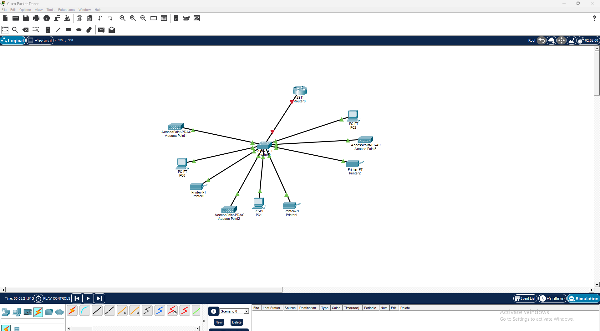

---

### 🔵 Step 2 — Configured VLANs and Access Ports on the Switch (CLI)

Created VLANs 10, 20, and 30 and assigned each group of access ports to its VLAN using `switchport mode access` and `switchport access vlan [ID]`.

Switch>en
Switch#conf t
Switch(config)#int range fa0/2-4
Switch(config-if-range)#switchport mode access
Switch(config-if-range)#switchport access vlan 10
Switch(config-if-range)#int range fa0/5-7
Switch(config-if-range)#switchport mode access
Switch(config-if-range)#switchport access vlan 20
Switch(config-if-range)#int range fa0/8-10
Switch(config-if-range)#switchport mode access
Switch(config-if-range)#switchport access vlan 30

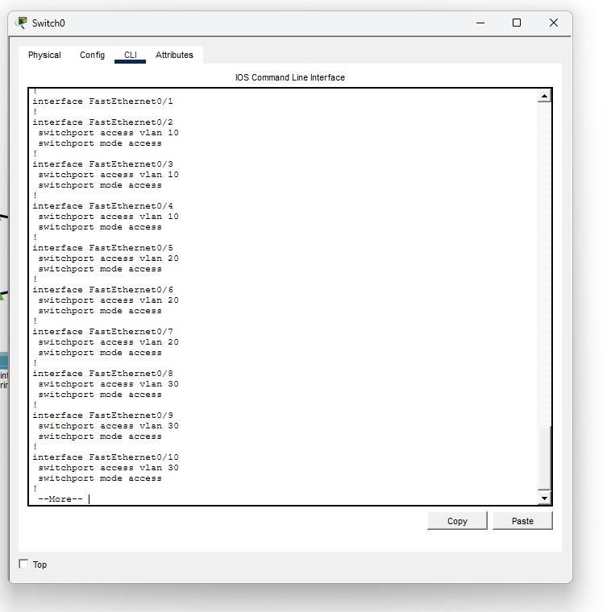

---

### 🔵 Step 3 — Verified VLAN Port Assignments

Ran `show running-config` to confirm all VLAN port assignments were saved correctly.

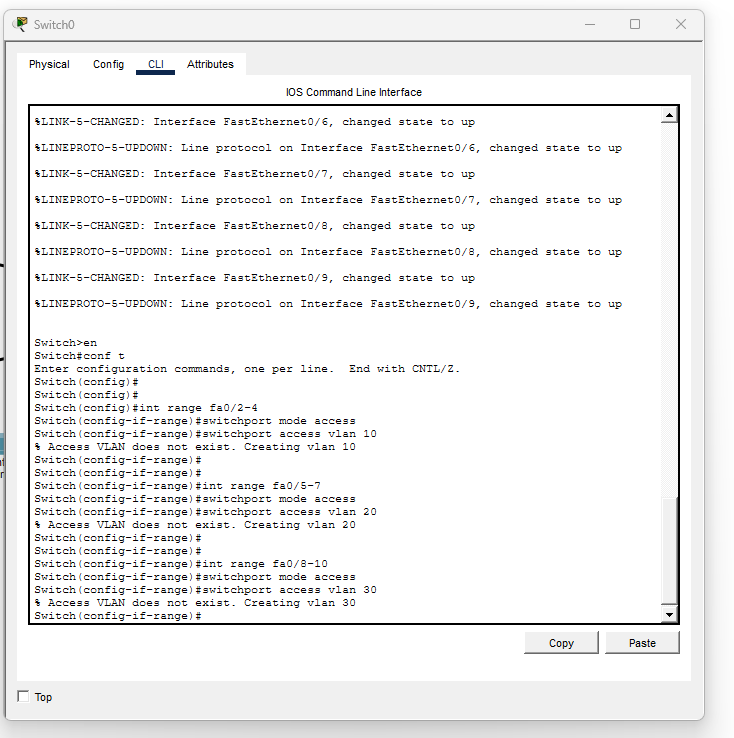

---

### ⚙️ Step 4 — Configured Router-on-a-Stick and DHCP Pools

Configured 802.1Q subinterfaces on Router0 for each VLAN and created three DHCP pools — one per department.

Router>en
Router#conf t
Router(config)#int gig0/0
Router(config-if)#no shutdown
Router(config-if)#int gig0/0.10
Router(config-subif)#encapsulation dot1q 10
Router(config-subif)#ip address 192.168.1.1 255.255.255.192
Router(config-subif)#int gig0/0.20
Router(config-subif)#encapsulation dot1q 20
Router(config-subif)#ip address 192.168.1.65 255.255.255.192
Router(config-subif)#int gig0/0.30
Router(config-subif)#encapsulation dot1q 30
Router(config-subif)#ip address 192.168.1.129 255.255.255.192
Router(config)#ip dhcp excluded-address 192.168.1.1
Router(config)#ip dhcp excluded-address 192.168.1.65
Router(config)#ip dhcp excluded-address 192.168.1.129
Router(config)#ip dhcp pool ADMIN_POOL
Router(dhcp-config)#network 192.168.1.0 255.255.255.192
Router(dhcp-config)#default-router 192.168.1.1
Router(config)#ip dhcp pool FINANCE_POOL
Router(dhcp-config)#network 192.168.1.64 255.255.255.192
Router(dhcp-config)#default-router 192.168.1.65
Router(config)#ip dhcp pool CS_POOL
Router(dhcp-config)#network 192.168.1.128 255.255.255.192
Router(dhcp-config)#default-router 192.168.1.129
Router(config-if)#do wr

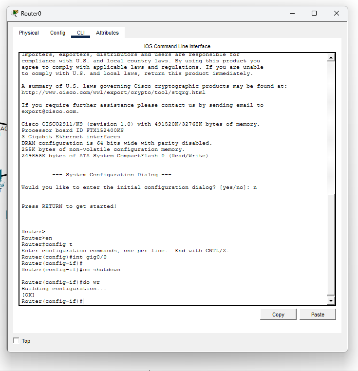

---

### 📡 Step 5 — Configured Finance/HR Access Point (Finance-WIFI)

Set SSID to **Finance-WIFI**, WPA2-PSK, AES encryption, passphrase `Finance@123`.

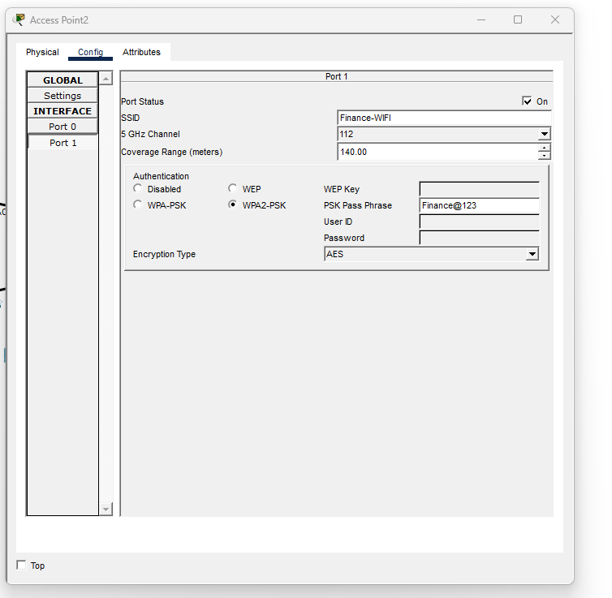

---

### 📡 Step 6 — Configured Customer Service Access Point (CS-WIFI)

Set SSID to **CS-WIFI**, WPA2-PSK, AES encryption, passphrase `Customer@123`.

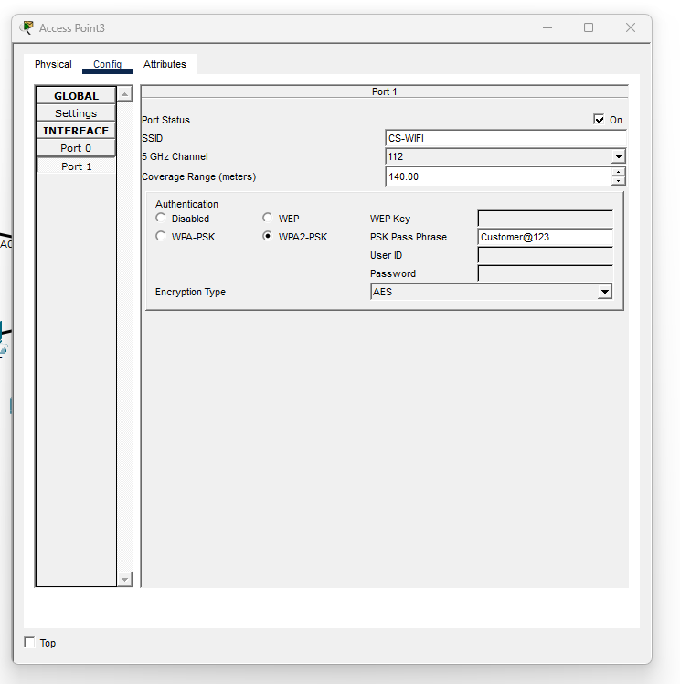

---

### 📡 Step 7 — Configured Admin/IT Access Point (Admin-WIFI)

Set SSID to **Admin-WIFI**, WPA2-PSK, AES encryption, passphrase `Admin@123`. Smartphone0 confirmed connection and received DHCP address 192.168.1.5 on VLAN 10.

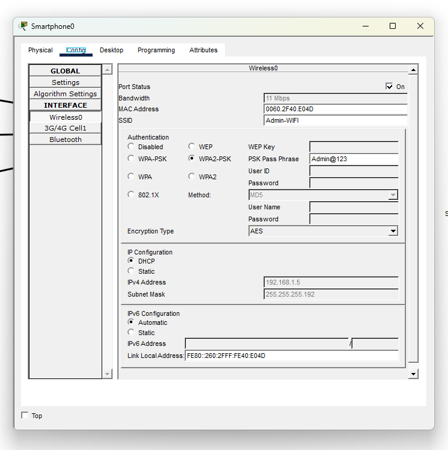

---

### 🖥️ Step 8 — Verified DHCP Assignment on PC0 (VLAN 10)

PC0 set to DHCP and confirmed lease: IP 192.168.1.2, gateway 192.168.1.1, mask 255.255.255.192.

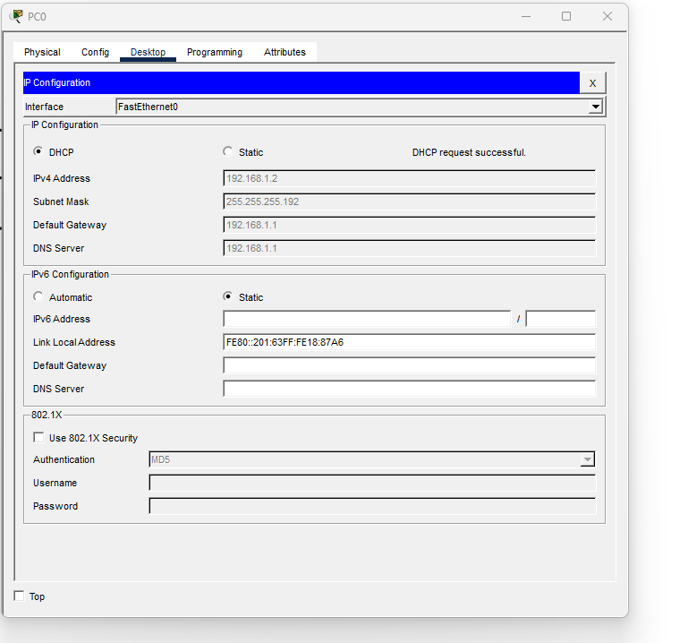

---

### ✅ Step 9 — Verified Cross-VLAN Connectivity (Smartphone0 → VLAN 30)

Pinged from Smartphone0 (VLAN 10 — Admin-WIFI) to 192.168.1.131 (VLAN 30 — Customer Service). Result: 3/4 replies — first packet ARP timeout, expected behavior. Inter-VLAN routing confirmed across wireless-to-wired path.

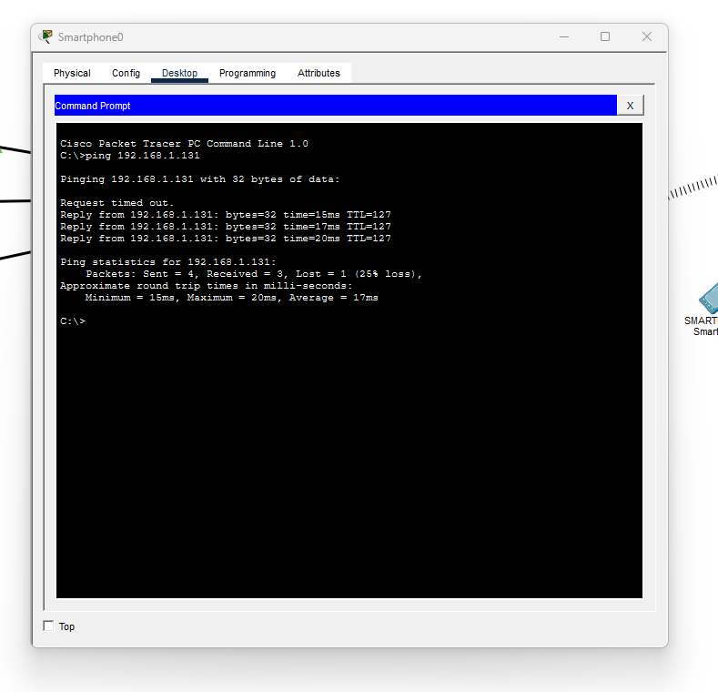

---

### ✅ Step 10 — Verified Cross-VLAN Connectivity (Tablet PC0 → VLAN 10)

Pinged from Tablet PC0 (VLAN 30) to 192.168.1.3 (VLAN 10 — Admin/IT). Result: 3/4 replies — bidirectional inter-VLAN routing confirmed.

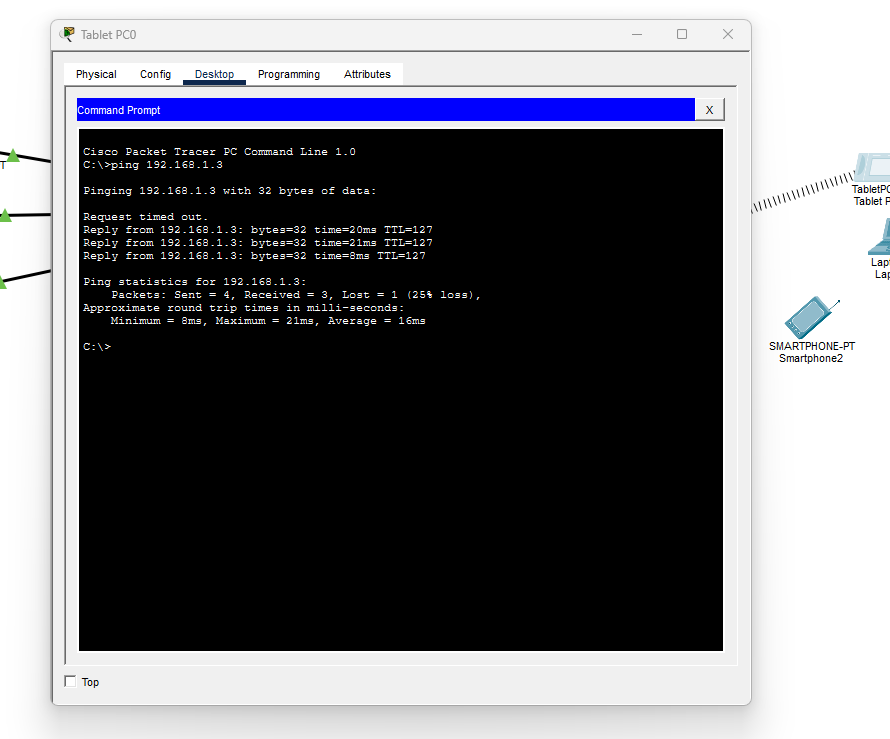

---

### 🌐 Step 11 — Final Topology

Completed topology showing all three VLANs active with wired and wireless endpoints connected and communicating through the central switch and router.

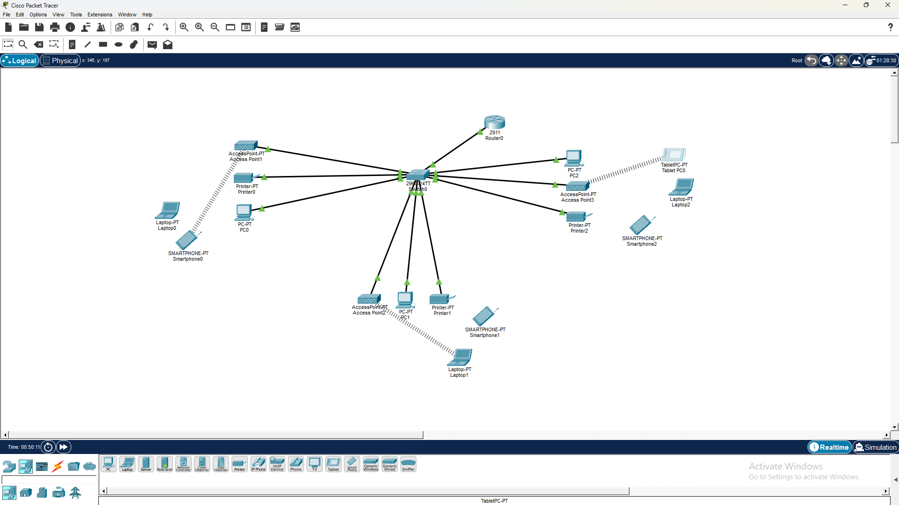

---

## Skills Demonstrated

| Skill | How It Was Applied |
|-------|--------------------|
| VLAN Configuration | Created VLANs 10/20/30 and assigned access ports via CLI |
| Trunk Port Setup | Configured switch uplink to router as 802.1Q trunk |
| Router-on-a-Stick | Subinterfaces per VLAN with dot1q encapsulation |
| DHCP Server Config | Three pools on router with gateway exclusions |
| Wireless Security | WPA2-PSK with AES per department SSID |
| Inter-VLAN Routing | Verified cross-VLAN ping from wireless and wired clients |
| Cisco IOS CLI | All configuration done via command line |
| Troubleshooting | Identified ARP timeout on first ping as expected behavior |

---

## Lessons Learned

**VLANs are a security boundary, not just a labeling system.** Separating departments means a compromised device in one VLAN cannot reach another without passing through the router — where ACLs and firewall rules can be enforced.

**Router-on-a-Stick scales with business complexity.** 802.1Q subinterfaces carry all VLAN traffic over a single physical link, which is the standard approach for small-to-medium enterprise branch networks.

**DHCP removes human error at scale.** Centralizing DHCP on the router with per-VLAN pools ensures every device gets the correct gateway and subnet automatically — no IP conflicts, no manual configuration per endpoint.

**The first ping timeout is not a failure — it is ARP.** Every cross-VLAN test showed 1 dropped packet on the first attempt. The first packet triggers ARP resolution before it can be forwarded. Understanding this separates someone who ran a test from someone who understands the result.

---

## References

- [Cisco IOS VLAN Configuration Guide](https://www.cisco.com/c/en/us/td/docs/switches/lan/catalyst2960/software/release/12-2_55_se/configuration/guide/scg_2960/swvlan.html)
- [Cisco Router-on-a-Stick Configuration](https://www.cisco.com/c/en/us/support/docs/lan-switching/inter-vlan-routing/41860-howto-L3-intervlanrouting.html)
- [Cisco Packet Tracer Download](https://www.netacad.com/courses/packet-tracer)
- [NIST SP 800-41 – Firewalls and Firewall Policy](https://csrc.nist.gov/publications/detail/sp/800-41/rev-1/final)
